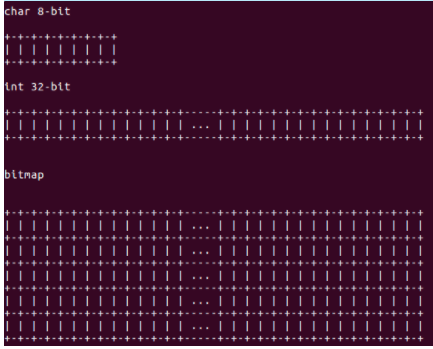

# 2_内核位操作和bitmap


## 内核基础位操作


### 基础功能

```c
#define BIT(x)	(1 << (x))  // 位基础操作
```


### ffs和fls

<font color=red>ffs用来查找二进制数中第一个为1的位</font>

<font color=red>fls用来查找二进制数中最后一个为1的位（注：都是从左边数起）</font>

<font color=red>ffz用来查找二进制数中第一个为0的位</font>

<font color=red>flz用来查找二进制数中最后一个为0的位</font>

注：如果参数为0， ffs和fls都为0， 否则为1-64


问题：如果自己实现该怎么实现？

- 最无聊的方法就是 从 低->高/高->低  每1bit进行判断。

- 比较好的方法就是 二分查找。
- X86系统还支持BSR和BSF指令快速查找


#### 用户态ffs

其实用户态也实现了ffs相关函数

```c
#include <strings.h>

int ffs(int i);
int ffsl(long int i);
int ffsll(long long int i);
```


#### 内核态ffs和fls

##### 位扫描指令 (了解）

这里值得一提的是：<font color=red>X86内部集成了 BSR和BSF位扫描指令</font>，可以快速检测，参考：[gcc 嵌入式汇编(asm)实现bsr(位扫描)指令](https://blog.csdn.net/10km/article/details/48997303)。

注：这里我们暂时只需要知道有这个功能就好


> BSR-逆向位扫描指令，BSF - 正向位扫描 (386以上CPU可用)
>
> 
>
> 格式: BSF dest, src
>
> 影响标志位: ZF
>
> 功能：从源操作数的的最低位向高位搜索，将遇到的第一个“1”所在的位序号存入目标[寄存器](https://baike.baidu.com/item/)寄存器中，
>
> 若所有位都是0，则ZF=1，否则ZF=0。
>
> 
>
> 格式: BSR dest, src
>
> 影响标志位: ZF
>
> 功能：从源操作数的的最高位向低位搜索，将遇到的第一个“1”所在的位序号存入目标[寄存器](https://baike.baidu.com/item/寄存器)中，
>
> 若所有位都是0，则ZF=1，否则ZF=0。


内核实现参考：[arch\x86\include\asm\bitops.h X86下汇编进行位扫描](https://github.com/torvalds/linux/blob/master/arch/x86/include/asm/bitops.h)

```c
static __always_inline unsigned long ffz(unsigned long word); // find first zero bit in word
static __always_inline int ffs(int x); // find first set bit in word - ffs=find first set
static __always_inline int fls(int x); // find last set bit in word  - fls=find last set
static __always_inline int fls64(__u64 x); // find last set bit in a 64-bit word

// 注：这里边带_ffs和_fls都是不进行异常检测的，用户必须在传参时判断参数为0的情况
// 那么如何实现ffs64呢？？？ 用ffs组合下即可
static inline unsigned long __ffs64(u64 word)
{
#if BITS_PER_LONG == 32
	if (((u32)word) == 0UL)
		return __ffs((u32)(word >> 32)) + 32;
#elif BITS_PER_LONG != 64
#error BITS_PER_LONG not 32 or 64
#endif
	return __ffs((unsigned long)word);
}
```


##### 软件实现ffs和fls

```C
/**
 * ffs - find first bit set，参数x为0返回0，其余返回1-32
 */
static __always_inline int ffs(unsigned int x)
{
	int r = 1;		// r为查找位置

	if (!x)			// 如果传入是0，则直接返回0
		return 0;
	if (!(x & 0xffff)) {	// 首次二分查找：查找低16-bit是否为0; 如果为0，则索引r+=16; 如果不为0，则索引不变，在低16-bit查找
		x >>= 16;
		r += 16;
	}
	if (!(x & 0xff)) {		// 再次二分查找：查找新数据的低8-bit是否为0；
		x >>= 8;
		r += 8;
	}
	if (!(x & 0xf)) {		// 再次二分查找：查找新数据的低4-bit是否为0
		x >>= 4;
		r += 4;
	}
	if (!(x & 3)) {			// 继续二分查找
		x >>= 2;
		r += 2;
	}
	if (!(x & 1)) {			// 最后一次二分查找
		x >>= 1;
		r += 1;
	}
	return r;
}

static __always_inline int fls(unsigned int x)  // x=0返回0，其余返回1-32
{
	int r = 32;					// 

	if (!x)
		return 0;
	if (!(x & 0xffff0000u)) {	// 同上，查询最高
		x <<= 16;
		r -= 16;
	}
	if (!(x & 0xff000000u)) {
		x <<= 8;
		r -= 8;
	}
	if (!(x & 0xf0000000u)) {
		x <<= 4;
		r -= 4;
	}
	if (!(x & 0xc0000000u)) {
		x <<= 2;
		r -= 2;
	}
	if (!(x & 0x80000000u)) {
		x <<= 1;
		r -= 1;
	}
	return r;
}

#define ffz(x)  __ffs(~(x))  // ffz实现很机智
#define flz(x)  __fls(~(x))  // ffz实现很机智


// 64位操作使用32位组合即可
static __always_inline  unsigned int s_ffs64(u64 word)
{
	if (((u32)word) == 0UL)
		return s_ffs((u32)(word >> 32)) + 32;
	return s_ffs((unsigned int)word);
}

// 64位操作使用32位组合即可,详情参考下边相关测试代码
```


### roundup_pow_of_two

最<font color=red>接近的（向上取整） 最大2的指数次幂, roundup_pow_of_two</font> 分析与实现：

思想： 2^n有个特点，就是    二进制数中最后一个为1， 其他位都为0.  那么实现非常简单了

首先判断这个数是不是2^n (只要判断与自己的mask相与，为0则是2^n,非0则不是2^n)，如果是，则就是它自己。 如果不是，那么 1<<fls64(x)即可

```c
#define roundup_pow_of_two(x) ( ((x) & (x-1)) ?  BIT(fls64(x)) : (x) )
```

内核实现思想一样：

```c

static inline __attribute__((const))
unsigned long __roundup_pow_of_two(unsigned long n)
{
	return 1UL << fls_long(n - 1);
}

#define roundup_pow_of_two(n)			\
(						\
	__builtin_constant_p(n) ? (		\
		(n == 1) ? 1 :			\
		(1UL << (ilog2((n) - 1) + 1))	\
				   ) :		\
	__roundup_pow_of_two(n)			\
 )
```


### 相关测试

驱动测试代码参考： [BITOPS_TEST](https://github.com/vici-by/Linux-kernel-test/tree/main/driver-test/base-struct/bitmap/test01)

测试方法：

```bash
make clean && make && insmod  bitops_test.ko
echo xxx  > /sys/module/bitops_test/parameters/run 
```


用户态测试代码参考：[s_bitops.h](https://github.com/vici-by/Linux-kernel-test/blob/main/app-test/usual_lib/s_bitops.h)


## 内核的bitmap


### 相关参考

- [linux内核的bitmap](https://blog.csdn.net/qqliyunpeng/article/details/53412802)
- [BiscuitOS](https://biscuitos.github.io/blog/BITMAP/)


### 什么是bitmap？


我们知道，bit是标识一个开关状态的最小单位。将多个连续的bit放在一起），比如8个，叫字节。如果用每一个bit标志一个状态，又叫bitmap。

简单说：bitmap就是一个数组，里边每一个位都是bool值来表示一个状态。




### bitmap框架


相关代码路径:


```
#include <linux/bitmap.h>

linux/include/asm-generic/bitops/atomic.h   这个定义了 单个bitmap操作接口,都是原子操作接口
linux/include/asm-generic/bitops/non-atomic.h 这个也定义了 单个bitmap操作接口，都是基础C操作接口
linux/include/linux/bitmap.h                              这个定义了批量操作，位查找等接口

linux/lib/bitmap.c 文件包含了 bitmap 的核心实现以及通用接口。
linux/include/linux/bitmap.h bitmap 头文件，包含了 bitmap 相关的宏以及内嵌函数接口
linux/Documentation/core-api/kernel-api.rst bitmap 内核文档
```


#### 创建一个bitmap

```
#define DECLARE_BITMAP(name,bits) \
    unsigned long name[BITS_TO_LONGS(bits)]
#define BITS_TO_LONGS(nr)   DIV_ROUND_UP(nr, BITS_PER_BYTE * sizeof(long))
#define DIV_ROUND_UP(n,d) (((n) + (d) - 1) / (d))
#define BITS_PER_BYTE       8
```


**roundup是为了向上按照某个值原整，比如d=32，那么这个数必须是32整数倍，结果要>=原值**


```
在32位系统下：
DECLARE_BITMAP(name, bits)  == unsigned long name[(bits+31)/32]

在64位系统下：
DECLARE_BITMAP(name, bits)  == unsigned long name[(bits+63)/64]

unsigned long *bitmap_zalloc(unsigned int nbits, gfp_t flags);
void bitmap_free(unsigned long *bitmap);
```

- name：unsigned long的数组名
- bits：这里看到roundup的作用了，保证分配的bit数是64/32位对齐

总结： DECLARE_BITMAP(name,bits)宏其实就是定义一个能包含指定bits数量的unsigned long型数组


#### Bitmap的掩码操作

```
BITMAP_FIRST_WORD_MASK: bitmap 低位指定个 bit 为零，其余全 1 的掩码，
BITMAP_LAST_WORD_MASK: bitmap 低位指定个 bit 为 1，其余全 0 的掩码

// BITMAP_FIRST_WORD_MASK 应用场景： 比如start从一个unsigned long中某一位开始要置1，
// BITMAP_FIRST_WORD_MASK = 0xffff_ffff_ffff_ffff << start
#define BITMAP_FIRST_WORD_MASK(start) (~0UL << ((start) & (BITS_PER_LONG - 1)))


// BITMAP_LAST_WORD_MASK 应用场景： 比如last到一个unsigned long中某一位开始要置1，
//  -(nbits) 数字的负数是补码存储，利用补码和移位来配置
#define BITMAP_LAST_WORD_MASK(nbits) (~0UL >> (-(nbits) & (BITS_PER_LONG - 1)))
```


#### Bitmap 置位、清零、填充操作

##### Bitmap单个位操作

```
/**
 * 单个bit位设置操作(这里看非原子操作接口)
 * BIT_WORD(nr); // 把bitmap看作一个unsigned long 的数组，判断nr对应数组索引
 * BIT_MASK(nr); // 从BIT_WORD找到所在的unsigned long的数据，然后判断nr对应当前数的bit位
 * unsigned long mask = BIT_MASK(nr);  可以看到对nr进行
 */
linux/include/asm-generic/bitops/non-atomic.h


static inline void __set_bit(int nr, volatile unsigned long *addr);     // 设置nr bit为1
static inline void __clear_bit(int nr, volatile unsigned long *addr);   // 清除nr bit
static inline void __change_bit(int nr, volatile unsigned long *addr);  // 翻转nr bit
static inline int __test_and_set_bit(int nr, volatile unsigned long *addr);     // 设置nr bit并返回old值
static inline int __test_and_clear_bit(int nr, volatile unsigned long *addr);   // 清除nr bit并返回old值
static inline int __test_and_change_bit(int nr,volatile unsigned long *addr);   // 翻转nr bit并返回old值
static inline int test_bit(int nr, const volatile unsigned long *addr);         // 确定是否设置了nr bit
```


##### Bitmap 批量位操作

```
__bitmap_set    // bitmap 批量置位操作
__bitmap_clear  // bitmap 批量清零操作
bitmap_zero     // bitmap 全部清零操作
bitmap_fill     // bitmap 全部填充操作
bitmap_copy     // bitmap 全部拷贝操作，最后一个qword如果未填满，则不管（根据情况，推荐用下边的接口）
bitmap_copy_clear_tail  // bitmap 全部拷贝，并只保留nbit，最后一个qword如果未填满，其余位全部清0（推荐）
    
    
// 批量设置bitmap 得连续位，从某个位开始设置多少字节 
// 这里主要分析一种情况：  [m][m+1]...[m+n] ，从m中某一个位开始，设置到m+n中得一个位
// unsigned long *p = map + BIT_WORD(start); // 先将p指向要配置得第一个qword索引中
// bits_to_set = BITS_PER_LONG - (start % BITS_PER_LONG);  这个为 start所在得qword得中需要设置多少位
// unsigned long mask_to_set = BITMAP_FIRST_WORD_MASK(start); m中需要设置多少位得mask
void __bitmap_set(unsigned long *map, unsigned int start, int len);
    while (len - bits_to_set >= 0) {    // 第一次循环：bits_to_set为 m中需要设置多少位
        *p |= mask_to_set;              // *p  设置当前bitmap所在得qword
        len -= bits_to_set;             // 长度修改
        bits_to_set = BITS_PER_LONG;    // 主要考虑到 [m+1]-[m+n-1]得循环情况，这里将对应qword 全设置为1
        mask_to_set = ~0UL;
        p++;
    }
    if (len) {                          // [m+n]得位设置
        mask_to_set &= BITMAP_LAST_WORD_MASK(size);
        *p |= mask_to_set;
    }
```


#### Bitmap 与、或、非、异或、与非操作

```
#include <linux/bitmap.h>

/*
  这部分函数比较简单，不做分析
  都是将 两个bitmap的指定bit 进行位操作
  Gcc的内建函数 __builtin_constant_p 用于判断一个值是否为编译时常数
 */

__bitmap_and: bitmap 与运算
__bitmap_or: bitmap 或运算
__bitmap_xor: bitmap 异或运算
__bitmap_complement: bitmap 非运算
__bitmap_andnot: bitmap 与非运算
```


#### Bitma的查找

```
/**
 * 用二分查找法 从 unsigned long 类型中找到第一个为1的bit
 * 这里未定义 word是0的情况，所以使用前必须自己检测word是否为0 (!!!)
 * 成功返回[64位：0-63] 或 [32位：0-31]
 */
static __always_inline unsigned long __ffs(unsigned long word);

__fls: 找到最后一个置位的位置
__ffs: 找到第一个置位的位置
ffz: 找到第一个清零的位置

// 查找函数的基类查找，
// addr2 在只有查找 与或非等逻辑位的时候，需要设置，其余addr2=NULL
static inline unsigned long _find_next_bit(const unsigned long *addr1,
        const unsigned long *addr2, unsigned long nbits,
        unsigned long start, unsigned long invert);


find_first_bit: 查找第一个置位的位置
find_first_zero_bit: 查找第一个清零的位置
find_last_bit: 找到最后一个置位的位置
find_next_and_bit: 查找下一个置位的位置，与上特定的值
find_next_bit: 查找下一个置位的位置
find_next_zero_bit: 查找下一个清零的位置
```


#### Bitma的遍历

```
for_each_clear_bit_from: 从指定位置遍历 bitmap 清零 bit
for_each_clear_bit: 从头开始遍历 bitmap 清零 bit
for_each_set_bit: 从头开始遍历 bitmap 置位 bit
for_each_set_bit_from: 从指定位置开始遍历 bitmap 置位 bit
```


## 测试用例

[Emulate PID Allocating and Releasing](https://biscuitos.github.io/blog/Human-Knowledge-Common/#H000014) （参考： https://biscuitos.github.io/blog/Human-Knowledge-Common/#B0）