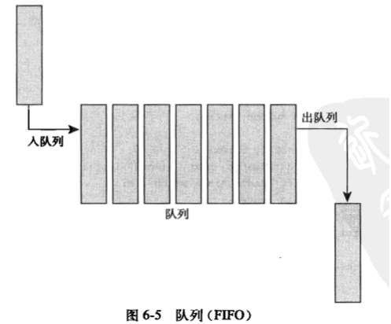
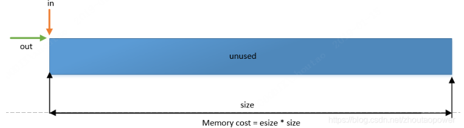
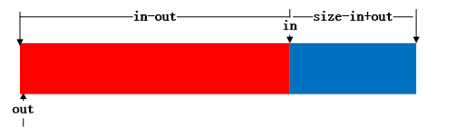
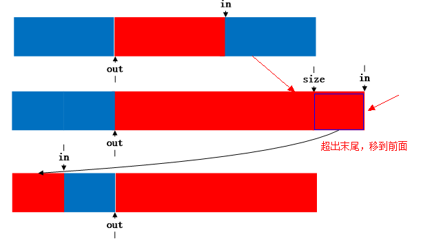

# 4_内核队列kfifo


## 相关参考

* [数据结构之内核队列kfifo](https://blog.csdn.net/u011298001/article/details/86063987)

* 《Linux内核设计与实现 第三版》 6.2章节


## 队列基础知识

我们知道 队列 也是一种 <font color=red>生产者消费者模型</font>，具有<font color=red>先进先出</font>的特点。



队列需要提供以下基本操作功能

- 队列的分配
- 队列的初始化
- 队列的释放
- 队列的数据入列
- 队列的数据出列
- 队列判满
- 队列判空


## 内核队列的实现

Linux内核链表位于 *include/linux/kfifo.h*  和 *lib/kfifo.c* 代码中 ，使用了一个<font color=red>环形缓冲区, 配合两个位置参数 in/out ，它们的差值来指定当前的 fifo 的状态.</font>


<font color=red>内核队列的设计精妙之处在于:</font>

-  <font color=red>保证缓冲区大小为2的次幂，不是的向上取整为2的次幂</font>。
- 使用无符号整数保存输入(in)和输出(out)的位置，在输入输出时不对in和out的值进行模运算，而让其自然溢出，并能够保证in-out的结果为缓冲区中已存放的数据长度.
- 将需要取模的运算用 & 操作代替（ a % size = (a & (size − 1)) ), 这需要size保证为2的次幂。
- 使用内存屏障(Memory Barrier)技术，实现单消费者和单生产者对kfifo的无锁并发访问，多个消费者、生产者的并发访问还是需要加锁的（本文不涉及）
  


这里只简单整理下常用API和 一些特殊点

注：可参考<font color=green>《Linux内核设计与实现 第三版》 6.2章节</font>，也可参考 [内核数据结构 —— 内核队列](https://blog.csdn.net/zhoutaopower/article/details/86491852)。


注：

<font color=red>队列中得recsize为record size，这里不考虑这种情况。</font>

```
DECLARE_KFIFO_PTR(fifo, type)	定义一个非record FIFO，名字为fifo，element类型为type，其数据需要动态分配。
DECLARE_KFIFO(fifo, type, size)	定义一个非record FIFO，名字为fifo，element类型为type，element个数为size，其数据静态存储在结构体中，size需为常数且为2的整数次方
INIT_KFIFO(fifo)	初始化DECLARE_KFIFO接口定义的fifo
DEFINE_KFIFO(fifo, type, size)	定义并初始化fifo
kfifo_initialized(fifo)	fifo是否初始化
kfifo_esize(fifo)	返回fifo的esize
kfifo_recsize(fifo)	返回fifo的recsize
kfifo_size(fifo)	返回fifo的size
kfifo_reset(fifo)	将in和out置0，注意：需要上锁。
kfifo_reset_out(fifo)	将out设置为in，由于只修改out，因此在读者上下文，且只有一个读者时，是安全的。否则需要上锁。
kfifo_len(fifo)	返回fifo中element的个数
kfifo_is_empty(fifo)	fifo是否为空 (in == out)
kfifo_is_full(fifo)	fifo是否满
kfifo_avail(fifo)	非record FIFO，返回可容纳的element个数
record FIFO，返回除去record头能容纳的字节数，最多不超过record头能表示的字节数，如recsize为1，最多返回255。
kfifo_skip(fifo)	跳过一个element或record
kfifo_peek_len(fifo)	获取下一个element或者record的字节长度。
kfifo_alloc(fifo, size, gfp_mask)	为指针式FIFO分配空间并初始化，成功返回0，错误则返回负数错误码
kfifo_free(fifo)	释放kfifo_alloc分配的内存
kfifo_init(fifo, buffer, size)	使用预分配的缓存初始化fifo，成功返回0，错误则返回负数错误码
kfifo_put(fifo, val)	这是一个宏，将val赋值给一个FIFO type类型的临时变量，然后将临时变量入队。存放一个element，如果成功返回入队的elements个数。如果FIFO满，则返回0。
kfifo_get(fifo, val)	val是一个指针，内部将val赋值给一个ptr指针类型的临时变量，并拷贝sizeof(*ptr)长度到val的地址。对于record FIFO，其是void类型，sizeof(void)为1，所以拷贝1个字节。非record类型，拷贝一个element。
如果FIFO为空，返回0，否则返回拷贝的element数。
kfifo_peek(fifo, val)	和kfifo_get相同，除了不更新out外。
kfifo_in(fifo, but, n)	入队n个elemnts。返回工程入队的elements数。
kfifo_in(fifo, buf, n, lock)	加锁入队。加锁方式为spin_lock_irqsave
kfifo_out(fifo, buf, n)	出队n个elements，返回成功拷贝的elements数
kfifo_out_spinlocked(fifo, buf, n, lock)	加锁出队。加锁方式位spin_lock_irqsave
kfifo_from_user(fifo, from, len, copied)	最多拷贝len个字节，参考record FIFO和非record FIFO的对应底层接口。
kfifo_to_user(fifo, to, len, copied)	最多拷贝len个字节到用户空间，参考record FIFO和非record FIFO的对应底层接口。

kfifo_out_peek(fifo, buf, n)	peek查看 n个elements的数据，但是内部out不动，返回拷贝的elements个数
```


### 队列的数据结构

```
struct __kfifo {
	unsigned int	in;      // 入列的时候增加的位置
	unsigned int	out;     // 出列的时候增加的位置
	unsigned int	mask;    // 巧妙的 mask 设计，同时包含了数据的个数信息
	unsigned int	esize;   // 元素的大小
	void            *data;   // 数据
};
```


### 队列的申请和释放

使用过程

```
// 定义kfifo
#ifdef DYNAMIC
static struct kfifo test_fifo;
#else
static DECLARE_KFIFO(test_fifo, unsigned char, FIFO_SIZE);
#endif


// 申请和初始化
#ifdef DYNAMIC
	int ret;
	ret = kfifo_alloc(&test_fifo, FIFO_SIZE, GFP_KERNEL);
	if (ret) {
		printk(KERN_ERR "error kfifo_alloc\n");
		return ret;
	}
#else
	INIT_KFIFO(test_fifo);
#endif
```


#### 申请宏

##### 使用struct kfifo定义

优点：动态分配内存

缺点：etype只能为unsigned char类型，不实用


先看下 struct kfifo，这个在内核藏得很深，找都找不到：

```C
struct kfifo __STRUCT_KFIFO_PTR(unsigned char, 0, void);

#define __STRUCT_KFIFO_PTR(type, recsize, ptrtype) \
{ \
	__STRUCT_KFIFO_COMMON(type, recsize, ptrtype); \
	type		buf[0]; \
}


#define __STRUCT_KFIFO_COMMON(datatype, recsize, ptrtype) \
	union { \
		struct __kfifo	kfifo; \
		datatype	*type; \
		const datatype	*const_type; \
		char		(*rectype)[recsize]; \
		ptrtype		*ptr; \
		ptrtype const	*ptr_const; \
	}


// 宏第一层展开==> 
struct kfifo {
	__STRUCT_KFIFO_COMMON(type, recsize, ptrtype);
	unsigned char		buf[0];
}；

// 宏第二层展开==>
struct kfifo {
	union {
		struct __kfifo	kfifo;
		unsigned char	*type;				// 这struct kfifo分配得fifo类型只能为unsigned char，这就是esize 使用kfifo_alloc很尴尬
		const unsigned char	*const_type; 
		char		(*rectype)[0];
		void		*ptr;
		void const	*ptr_const;
	};
	unsigned char		buf[0];
};

// 所以，这就是kfifo得结构体拉
```


##### 使用DECLARE_KFIFO定义

优点：可以指定etype得类型

缺陷：申请得空间都只能放在全局段中（如果放在栈中可能空间不够）

```c
/**
 * DECLARE_KFIFO - macro to declare a fifo object
 * @fifo: name of the declared fifo
 * @type: type of the fifo elements
 * @size: the number of elements in the fifo, this must be a power of 2
 */
#define DECLARE_KFIFO(fifo, type, size)	STRUCT_KFIFO(type, size) fifo	// 这个静态分配宏笔记好，可以自定义type(也就是fifo elements)


#define STRUCT_KFIFO(type, size) \
	struct __STRUCT_KFIFO(type, size, 0, type)
	
	
#define __STRUCT_KFIFO(type, size, 0, type) \
{ \
	__STRUCT_KFIFO_COMMON(type, recsize, type); \
	type		buf[((size < 2) || (size & (size - 1))) ? -1 : size]; \ 
}

// 宏展开==>
DECLARE_KFIFO(fifo, type, size)
	struct {
        union {
            struct __kfifo	kfifo;
            type	* etype;			// 这个etype就是元素类型，可以自定义type
            
            const type	*const_type;
            char		(*rectype)[0];
            type		*ptr;
            type const	*ptr_const;
        }；
        type		buf[((size < 2) || (size & (size - 1))) ? -1 : size];
	}fifo；

```


##### 使用DECLARE_KFIFO_PTR 定义

优点：既可以指定类型，也能动态分配，好评

```c
/**
 * DECLARE_KFIFO_PTR - macro to declare a fifo pointer object
 * @fifo: name of the declared fifo
 * @type: type of the fifo elements
 */
#define DECLARE_KFIFO_PTR(fifo, type)	STRUCT_KFIFO_PTR(type) fifo

#define STRUCT_KFIFO_PTR(type) \
	struct __STRUCT_KFIFO_PTR(type, 0, type)
	
#define __STRUCT_KFIFO_PTR(type, recsize, ptrtype) \
{ \
	__STRUCT_KFIFO_COMMON(type, recsize, ptrtype); \
	type		buf[0]; \
}

// 宏展开==>
DECLARE_KFIFO_PTR(fifo, type)
	struct {
        union {
            struct __kfifo	kfifo;
            type	* etype;			// 这个etype就是元素类型，可以自定义type
            
            const type	*const_type;
            char		(*rectype)[0];
            type		*ptr;
            type const	*ptr_const;
        }；
        type		buf[0];
	} fifo；

// 然后用户在使用kfifo_alloc进行分配即可
kfifo_alloc
```


##### 动态申请

先看一下：kfifo_alloc

```
/**
 * kfifo_alloc - dynamically allocates a new fifo buffer
 * @fifo: pointer to the fifo		          # 指向fifo得指针，用户必须先定义 struct kfifo xxx,
 * @size: the number of elements in the fifo  # fifo得大小，必须是2得指数（虽然会向上取整，不过自己分配时写好不是更好么）
 * @gfp_mask: get_free_pages mask, passed to kmalloc() # 因为时动态分配fifo大小，所以这里又GFP参数，根据是否休眠写GFP_KERNEL/GFP_ATOMIC
 */


#define kfifo_alloc(fifo, size, gfp_mask) \
__kfifo_int_must_check_helper( \
({ \
	typeof((fifo) + 1) __tmp = (fifo); \
	struct __kfifo *__kfifo = &__tmp->kfifo; \
	__is_kfifo_ptr(__tmp) ? \
	__kfifo_alloc(__kfifo, size, sizeof(*__tmp->type), gfp_mask) : \
	-EINVAL; \
}) \
)


# 宏展开下
struct kfifo  kfifo;
__kfifo_int_must_check_helper((  // 可以忽略
{
	typeof((&kfifo) + 1) __tmp = (&kfifo); 	// 
	struct __kfifo *__kfifo = &__tmp->kfifo; 
	(sizeof(*__tmp) == sizeof(struct __kfifo)) ? __kfifo_alloc(__kfifo, 8, sizeof(*__tmp->type), gfp_mask) : -1;
}
));

其实实质为：
__kfifo_alloc(  &(kfifo.kfifo), 8, 1， gfp_mask );
```

问个问题： 

<font color=#8f4b2e>typeof((fifo) + 1) __tmp = (fifo);   为什么要加1？？？</font>

参考：[what is typeof((c) + 1) in C](https://stackoverflow.com/questions/4436889/what-is-typeofc-1-in-c)

> The `typeof` operator in plain C (not C++) is a GCC addition to the standard. It tells the compiler you want to use the type of the expression enclosed in parenthesis.
>
> Using `typeof` as above, you can declare variables of types unknown to you or in that context, using another variable's type as reference. It can also be used for casting.
>
> The `+` operation inside `typeof` has a peculiar effect. `typeof((c) + 1)` means *"the type of c, or the type of 1, whichever would remain after promotion"*. Remember that, for example, chars are promoted to ints when used in operations involving ints, ints are promoted to floats, floats to doubles, etc.
>
> So, `typeof(int_variable + char_variable)` is `int`, since the `char` would be promoted to `int` to perform the operation.
>
> Note that only the compiler can resolve this: `typeof` doesn't evaluate, it has no value, nothing happens at run-time.
>
> The full description of `typeof` can be [found here](http://gcc.gnu.org/onlinedocs/gcc/Typeof.html).


```

#define kfifo_alloc(fifo, size, gfp_mask) .....

int __kfifo_alloc(struct __kfifo *fifo, unsigned int size,
		size_t esize, gfp_t gfp_mask)  // esize 其实最后为
{
	size = roundup_pow_of_two(size);  // 如果传入参数不是2^n，那么向上取整为2^n

	fifo->in = 0;
	fifo->out = 0;
	fifo->esize = esize;	// esize为每个元素的大小，这里为1

	fifo->data = kmalloc(size * esize, gfp_mask);	// 申请内存

	fifo->mask = size - 1;			// 我们知道 2^n掩码是 2^n-1（低bit全部为1）

	return 0;
}

```

esize 赋值给 fifo->esize 这个是代表了队列中数据的类型的 size，比如队列数据类型如果为 int，则 esize 等于 4.




#### 释放

动态申请的kfifo一定要释放

```
/**
 * kfifo_free - frees the fifo
 * @fifo: the fifo to be freed
 */
#define kfifo_free(fifo) ......
```


### 队列的入队

```c
/**
 * kfifo_put - put data into the fifo
 * @fifo: address of the fifo to be used
 * @val: the data to be added
 *
 * This macro copies the given value into the fifo.
 * It returns 0 if the fifo was full. Otherwise it returns the number
 * processed elements.
 *
 * Note that with only one concurrent reader and one concurrent
 * writer, you don't need extra locking to use these macro.
 */
#define	kfifo_put(fifo, val) \
({ \
	typeof((fifo) + 1) __tmp = (fifo); \
	typeof(*__tmp->const_type) __val = (val); \
	unsigned int __ret; \
	size_t __recsize = sizeof(*__tmp->rectype); \
	struct __kfifo *__kfifo = &__tmp->kfifo; \
	if (__recsize) \
		__ret = __kfifo_in_r(__kfifo, &__val, sizeof(__val), \
			__recsize); \
	else { \
		__ret = !kfifo_is_full(__tmp); \
		if (__ret) { \
			(__is_kfifo_ptr(__tmp) ? \
			((typeof(__tmp->type))__kfifo->data) : \
			(__tmp->buf) \
			)[__kfifo->in & __tmp->kfifo.mask] = \
				*(typeof(__tmp->type))&__val; \
			smp_wmb(); \
			__kfifo->in++; \
		} \
	} \
	__ret; \
})


检查太严格了，简化下大概原理：
#define	kfifo_put(fifo, val)
	__ret = !kfifo_is_full(__tmp); // 入队前肯定要先判断队列是否满了。 __ret是0表示满，非0表示未满
	__kfifo->data[__kfifo->in & __tmp->kfifo.mask] = *(&val)   // __kfifo->in & __tmp->kfifo.mask 避免越界，或者越界后自定回0
															   // 所以 kfifo只支持基础类型，不支持复合类型
	smp_wmb(); // 写内存屏障
	_kfifo->in++;
注： __recsize 是 什么？ 
```




### 队列的出队

```c
/**
 * kfifo_get - get data from the fifo
 * @fifo: address of the fifo to be used
 * @val: address where to store the data
 *
 * This macro reads the data from the fifo.
 * It returns 0 if the fifo was empty. Otherwise it returns the number
 * processed elements.
 *
 * Note that with only one concurrent reader and one concurrent
 * writer, you don't need extra locking to use these macro.
 */
#define	kfifo_get(fifo, val) \
__kfifo_uint_must_check_helper( \
({ \
	typeof((fifo) + 1) __tmp = (fifo); \
	typeof(__tmp->ptr) __val = (val); \
	unsigned int __ret; \
	const size_t __recsize = sizeof(*__tmp->rectype); \
	struct __kfifo *__kfifo = &__tmp->kfifo; \
	if (__recsize) \
		__ret = __kfifo_out_r(__kfifo, __val, sizeof(*__val), \
			__recsize); \
	else { \
		__ret = !kfifo_is_empty(__tmp); \
		if (__ret) { \
			*(typeof(__tmp->type))__val = \
				(__is_kfifo_ptr(__tmp) ? \
				((typeof(__tmp->type))__kfifo->data) : \
				(__tmp->buf) \
				)[__kfifo->out & __tmp->kfifo.mask]; \
			smp_wmb(); \
			__kfifo->out++; \
		} \
	} \
	__ret; \
}) \
)

同样简化下大概原理：
#define	kfifo_get(fifo, val)
	__ret = !kfifo_is_empty(__tmp); // 入队前肯定要先判断队列是否满了。 __ret是0表示满，非0表示未满
	*(val) = __kfifo->data[__kfifo->out & __tmp->kfifo.mask]   // __kfifo->out & __tmp->kfifo.mask 避免越界，或者越界后自定回0
	smp_wmb(); // 写内存屏障
	_kfifo->out++;
注： __recsize 是 什么？ 
```


添加一个元素：如果in 超过了mask值，直接返回到队首





查看队首元素，而不pop

```
#define	kfifo_peek(fifo, val) \
__kfifo_uint_must_check_helper( \
({ \
	typeof((fifo) + 1) __tmp = (fifo); \
	typeof(__tmp->ptr) __val = (val); \
	unsigned int __ret; \
	const size_t __recsize = sizeof(*__tmp->rectype); \
	struct __kfifo *__kfifo = &__tmp->kfifo; \
	if (__recsize) \
		__ret = __kfifo_out_peek_r(__kfifo, __val, sizeof(*__val), \
			__recsize); \
	else { \
		__ret = !kfifo_is_empty(__tmp); \
		if (__ret) { \
			*(typeof(__tmp->type))__val = \
				(__is_kfifo_ptr(__tmp) ? \
				((typeof(__tmp->type))__kfifo->data) : \
				(__tmp->buf) \
				)[__kfifo->out & __tmp->kfifo.mask]; \
			smp_wmb(); \
		} \
	} \
	__ret; \
}) \
)


同样简化下大概原理：（其实和get一样，只是不移动out指针
#define	kfifo_peek(fifo, val)
	__ret = !kfifo_is_empty(__tmp); // 入队前肯定要先判断队列是否满了。 __ret是0表示满，非0表示未满
	*(val) = __kfifo->data[__kfifo->out & __tmp->kfifo.mask]   // __kfifo->out & __tmp->kfifo.mask 避免越界，或者越界后自定回0
	smp_wmb(); // 写内存屏障
注： __recsize 是 什么？ 
```


<font color=red>kfifo的巧妙之处在于in和out定义为无符号类型，在put和get时，in和out都是增加，当达到最大值时，产生溢出，使得从0开始，进行循环使用。</font>：

<font color=red>注：这里有一个小技巧，  使用得时候都是 __kfifo->data[__kfifo->out & __tmp->kfifo.mask]，但索引得时候， in++和out++, 并不受mask得管控，所以可以增长到最大值直到反转) </font>

注：即使是反转了， 0-0xfffffffe 最后得结果也是2，可以计算出正确得长度。


### 队列的判空判满

```
#define kfifo_len(fifo) \
({ \
	typeof((fifo) + 1) __tmpl = (fifo); \
	__tmpl->kfifo.in - __tmpl->kfifo.out; \	
})


#define	kfifo_is_full(fifo) \
({ \
	typeof((fifo) + 1) __tmpq = (fifo); \
	kfifo_len(__tmpq) > __tmpq->kfifo.mask; \
})


#define	kfifo_is_empty(fifo) \
({ \
	typeof((fifo) + 1) __tmpq = (fifo); \
	__tmpq->kfifo.in == __tmpq->kfifo.out; \
})
```


### 内核kfifo demo

内核提供了一个demo程序，参考：

[inttype-example.c](https://github.com/torvalds/linux/blob/master/samples/kfifo/inttype-example.c)

[kfifo测试代码](https://github.com/vici-by/Linux-kernel-test/tree/main/driver-test/base-struct/kfifo)

[record-example.c](https://github.com/torvalds/linux/blob/master/samples/kfifo/record-example.c) 


## 用户态队列的移植

[usual_lib](https://github.com/vici-by/Linux-kernel-test/tree/main/app-test/usual_lib)