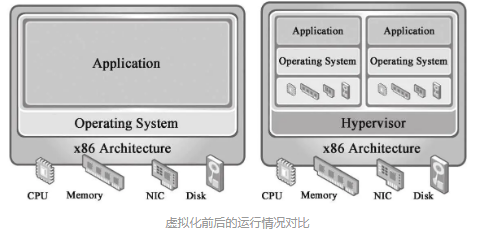
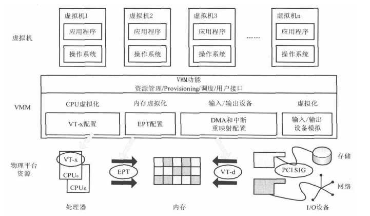
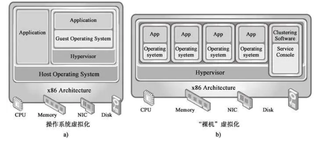
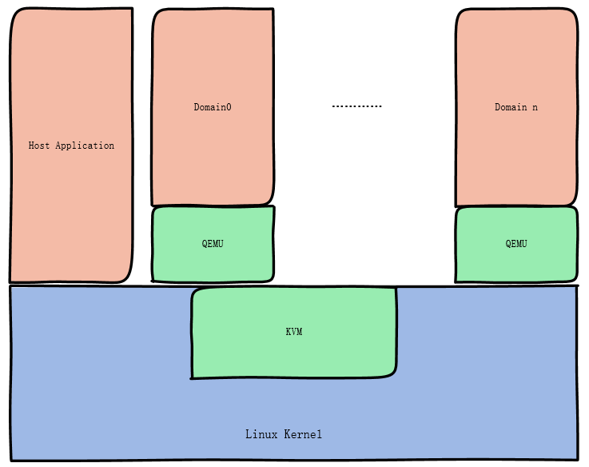
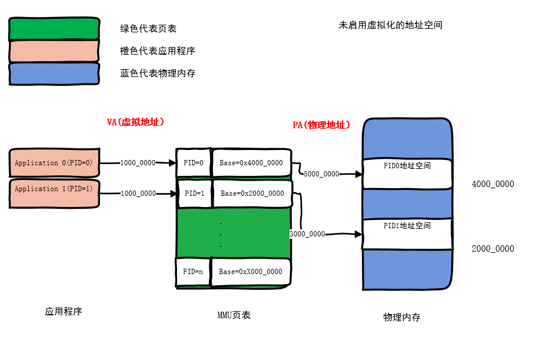
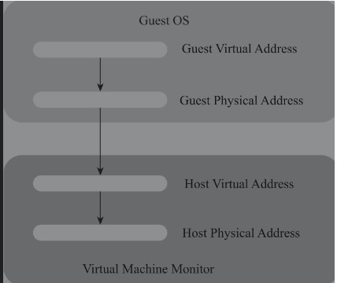
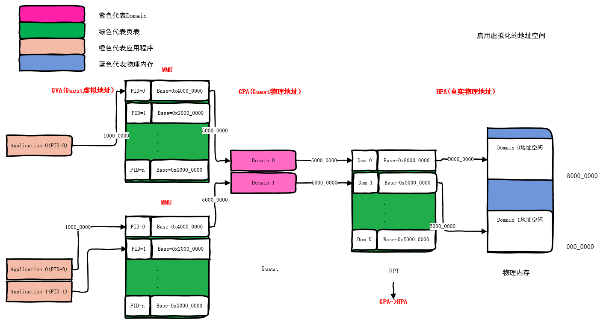
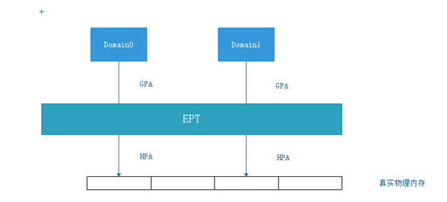
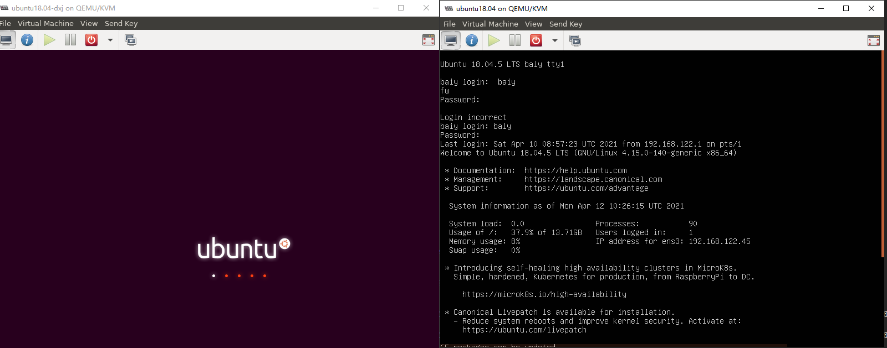

# 虚拟化简述

## 相关参考

[Shared Virtual Memory in KVM](https://events19.linuxfoundation.cn/wp-content/uploads/2017/11/Shared-Virtual-Memory-in-KVM_Yi-Liu.pdf)

## 什么是虚拟化？

> 美国环境保护署 (EPA)报告的一组有趣的统计数据发现，实际上服务器只有5%的时间是在工作的。在其他时间，服务器都处于“休眠”状态。

虚拟化 就是 在一台物理主机上，可以运行多个系统，使得远程用户感觉在独占这个机器一样。

所以有了虚拟化，虚拟化目的：为了充分利用计算机资源（硬件资源和软件资源）

**虚拟化方式：在之前的操作系统层在加一个虚拟层，然后同时可运行多个操作系统。**

**虚拟化是构建云基础架构不可或缺的关键技术之一**。虚拟化在**资源的有效利用、动态调配和高可靠性方面有着巨大的优势****。**

## KVM虚拟化

Bare-metal虚拟化和Host OS虚拟化方式

KVM虚拟化的结构与操作系统虚拟化类似

## CPU和各种地址

### 未启用虚拟化的地址

* APP（具有独一无二的ID号：PID）发出了VA(虚拟地址)。

* 从MMU页表上找到PID对应的页表项，获取转换信息。
* 转换为真实的PA(物理地址 )。

 虚拟地址的作用： 对用户空间使用虚拟地址，可以使得应用程序的兼容性好（每一个应用程序都彷佛运行在自己独占的内存空间），且不需要关心底层实现。

### 虚拟机引来的几种地址

1）客户机虚拟地址，GVA（Guest Virtual Address）

2）客户机物理地址，GPA（Guest Physical Address）

3）宿主机虚拟地址，HVA（Host Virtual Address）

4）宿主机物理地址，HPA（Host Physical Address）

### 启用虚拟化的地址空间

所以，一个虚拟机的应用程序访问内存，经过了： GVA->GPA->HPA的转换，中间有两层页表：MMU和EPT。

对于每个Domain（虚拟机）来说， 看待内存就像使用真实的物理内存一样， 发出Guest 物理地址（GPA）。 

但实际会被硬件EPT页表接收，并转换到 真实的Host物理内存上（HPA）。 

所以 Domain0 和 Domain1 发出相同的物理地址，会落到不同的物理内存上。

## KVM虚拟化

