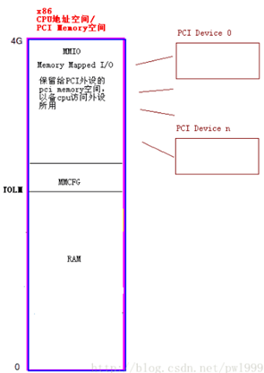
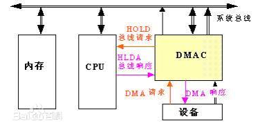
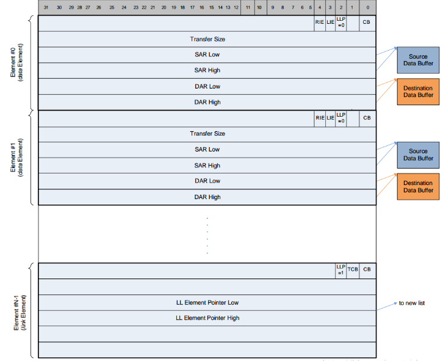
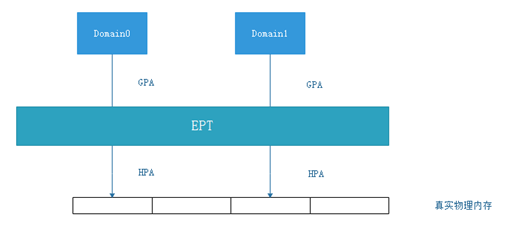
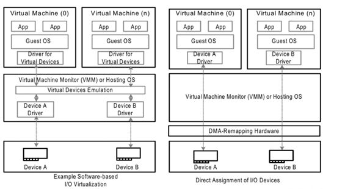
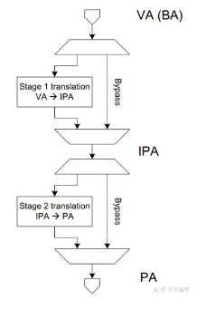
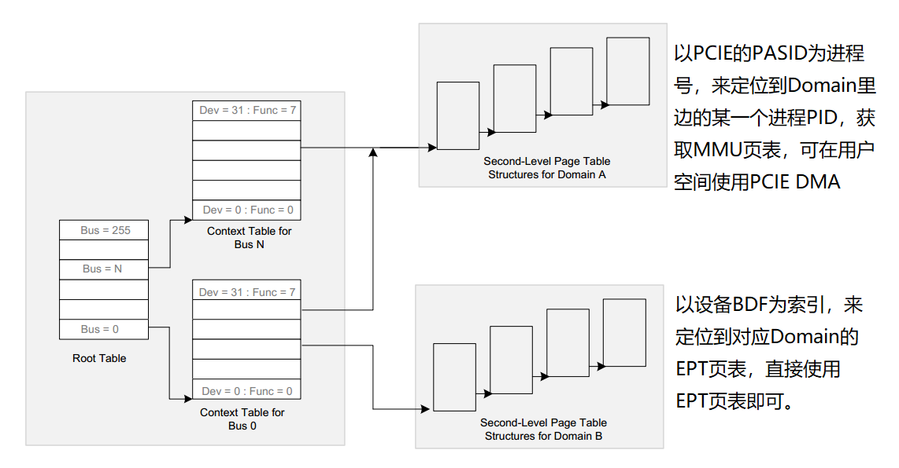
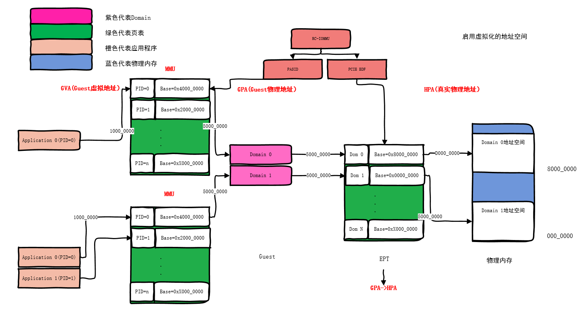

# IOMMU和DMA


## X86地址结构

<font color=red>什么是存储域地址，什么是总线域地址?</font>

* <font color=red>物理地址是指站在CPU角度，CPU经过MMU（+EPT）之后发出的地址，可以落实到真实的物理MMIO空间，用来访问内存或者设备</font>

* <font color=red>总线地址是指从从设备角度来看整个CPU端的地址，会将CPU端MMIO空间全部映射在设备端（一般是设备端提供一个基地址，访问 基地址+offset 即可访问到CPU端的地址， 这个基地址+偏移， 就是外设使用的总线地址</font>
* 使用一致性dma或者流式dma接口时，会 根据设备来将 CPU地址转换为总线地址返回。


### 存储域地址

X86其实除去  64K多的IO空间，也就是个MMIO设备(将所有外设映射到CPU 地址域)



所以CPU访问PCIe设备，可以直接发出地址信息即可。 中间会被RC接管，转成实际的TLP包去和对应的PCIe外设进行交互。

<font color=red>站在CPU的角度，有个地址映射表，发出不同的地址范围 访问到不同的外设（包括主存），这就是存储域地址空间（也叫CPU地址空间）</font>


### 总线域地址

**<font color=red>注：对硬件不了解的，可以忽略，假设一致</font>**

我们在看PCIe文档的时候，有过描述：

PCIe 配置空间中，BAR(0x10开始的2-6个地址空间)是总线地址， CPU不能直接去使用，要根据转换后的地址（其实就是有个offset偏移）进行使用。

什么是总线地址？  什么叫站在设备的角度看CPU地址空间？ 

<font color=red>在SOC设备上，总线地址 基本 等于存储域地址，因为总线地址和存储域地址 的地址表 相等，但我们使用时也不能去假设，还是要依赖于ASIC设计。</font>

<font color=red>在X86架构上，总线地址  ，不一定和存储域地址相等。 特别是PCIe设备，外边挂接的设备可能有很大空间的外设存储（比如显存）。ASIC设计的时候，会分布自己PCIe设备的地址表.</font>

比如：外设发出 0-256G的地址是自己外设存储的空间， 发出256G以上的的地址，就是PCIe所链接的CPU的存储域空间（一个简单的offset)。 


同时，我们软件所说的 DMA使用总线地址而不使用物理地址，  就是因为我们 去驱动一个外设的时候，不能假设主机有DMA， 所以必须使用设备的DMA。 

设备的DMA所在位置是设备，发出的地址寻址是设备的，所以DMA使用的地址空间是：总线地址。


```
               CPU                  CPU                  Bus
             Virtual              Physical             Address
             Address              Address               Space
              Space                Space

            +-------+             +------+             +------+
            |       |             |MMIO  |   Offset    |      |
            |       |  Virtual    |Space |   applied   |      |
          C +-------+ --------> B +------+ ----------> +------+ A
            |       |  mapping    |      |   by host   |      |
  +-----+   |       |             |      |   bridge    |      |   +--------+
  |     |   |       |             +------+             |      |   |        |
  | CPU |   |       |             | RAM  |             |      |   | Device |
  |     |   |       |             |      |             |      |   |        |
  +-----+   +-------+             +------+             +------+   +--------+
            |       |  Virtual    |Buffer|   Mapping   |      |
          X +-------+ --------> Y +------+ <---------- +------+ Z
            |       |  mapping    | RAM  |   by IOMMU
            |       |             |      |
            |       |             |      |
            +-------+             +------+
```


这里如果看不懂的，可以假定总线地址是和CPU地址有个一一映射的关系，方便后边理解。


### DMA的传输

DMA即Direct Memory Access，是一种允许 **外设和主内存之间直接传输 数据  而没有CPU参与的技术**，当外设对于该块内存的读写完成之后，DMAC通过中断通知CPU，然后由CPU完成后处理。




DMA传输的特点：

* 不需要CPU参与。

* 使用总线地址（与物理地址对应），且地址必须连续。

* 就算使用Linked List-Mode的DMA，使得支持 物理地址聚合和离散， 但实际上 是将一次次DMA进行链表打包，从实际上来说每个链表组内地址都必须连续。

  

  


## IOMMU

### IOMMU的基础

在《虚拟化简述》里边介绍了虚拟化的几种地址概念，那么什么是IOMMU？ 

<font color=red>我们先假设 物理地址和总线地址一一对应</font>


在虚拟化之后， 每一个虚拟机发出的地址都是GPA，访问实际的物理内存还需要真实的物理内存HPA，在主机端有EPT，那设备端咋办？

EPT是硬件转换， 那么在虚拟机里边能看到的物理地址都是GPA，   如何使用PCIE设备的DMA？总不能把GPA对应的总线地址给DMA把？




方法1： 在Host里边使用设备，所有通信经过Host转给各个虚拟机。

方法2： 给外设加个页表，将外设过来的地址 转为HPA  。:100:


参考： [vfio概述(vfio/iommu/device passthrough)](https://www.cnblogs.com/yi-mu-xi/p/12370626.html) 

IOMMU位于X86主机或ARM服务器的RC上。 可以将设备DMA传输的虚拟地址 转换为真实的物理地址HPA.


:sun_with_face:所以，<font color=red>IOMMU就像一个桥梁，将虚拟机DomainX与设备关联起来， 可以直接在虚拟机中使用真实的外设进行数据传输，而不需要经过主机。</font>





### IOMMU的实现

因为IOMMU是将设备与虚拟机直接关联，所以最主要的两点就是：

1. 与EPT对应的 地址转换。
2. 中断的分发
3. 与MMU对应的 地址转换。 // IOMMU的另一个特性


### IOMMU的地址转换

在上边可以看到,IOMMU挂在RC上， 所以应用在PCIe设备上。  但PCIE是如何与设备的EPT页表挂钩来进行地址转换的？

IOMMU的两级转换（可以单独开启任何一级）：



* IOMMU使用stage2 GPA->HPA 进行地址转换。 那么只需要让DMA在过IOMMU时，也指向对应Guest的EPT页表，那么就可以支持虚拟化场景了。

* IOMMU也支持stage1 GVA->GPA转换， 所以在知道进程ID的情况，我们只需要将GPA 按照 进程的页表 进行转换下，那么就可以到GVA，让DMA可以在用户空间可见。


#### 





所以，在两级MMU全开的情况，我们在Application里边可以直接分配GVA->总线地址 给 绑定的PCIE设备，来使用PCIE设备的DMA。

PCIE DMA使用GVA对应的地址， 经过IOMMU时， 一级转换（根据PASID找到PID 对应的MMU上）将GVA转为了GPA。 二级转换（根据BDF找到当前设备所挂接的Domain，再而找到了EPT的索引）将GPA转为了HPA。 这样就可以传输到真实的物理内存上了。


所以，IOMMU的优点是：

1. 使得虚拟机可以直接使用PCIE硬件， 直接使用Guest PA与PCIE设备进行数据交互。
2. 使得虚拟机里边的应用 可以直接使用PCIE硬件， 直接使用Guest VA与PCIE设备进行数据交互。
3. 因为页表的存在，DMA发出连续的虚拟地址，对应的物理地址不一定连续（支持硬件的非连续DMA传输）