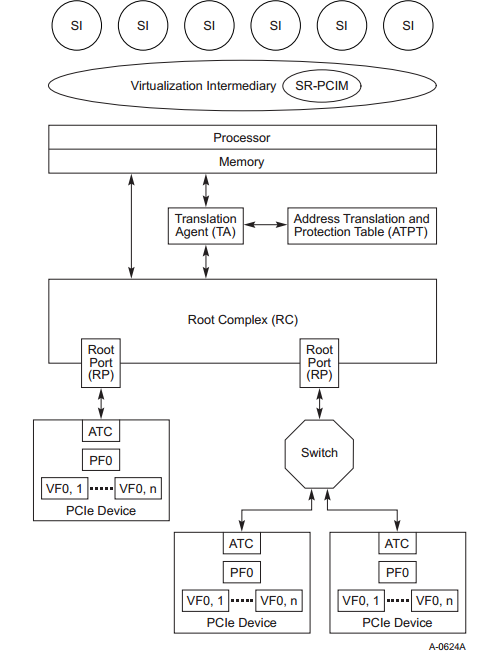
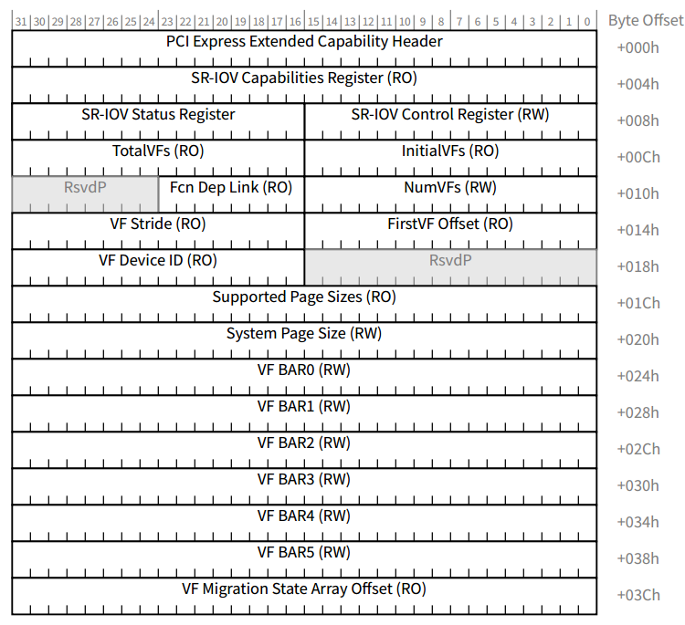
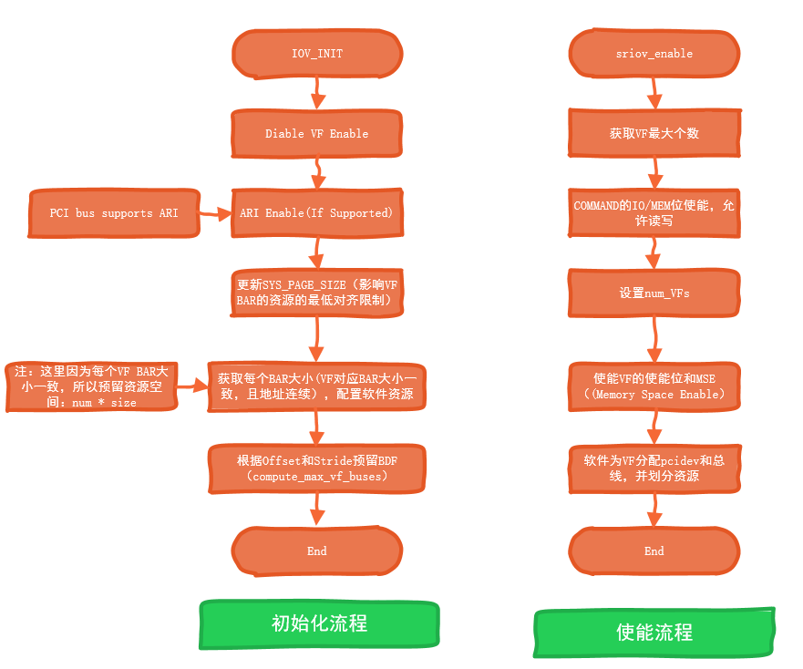
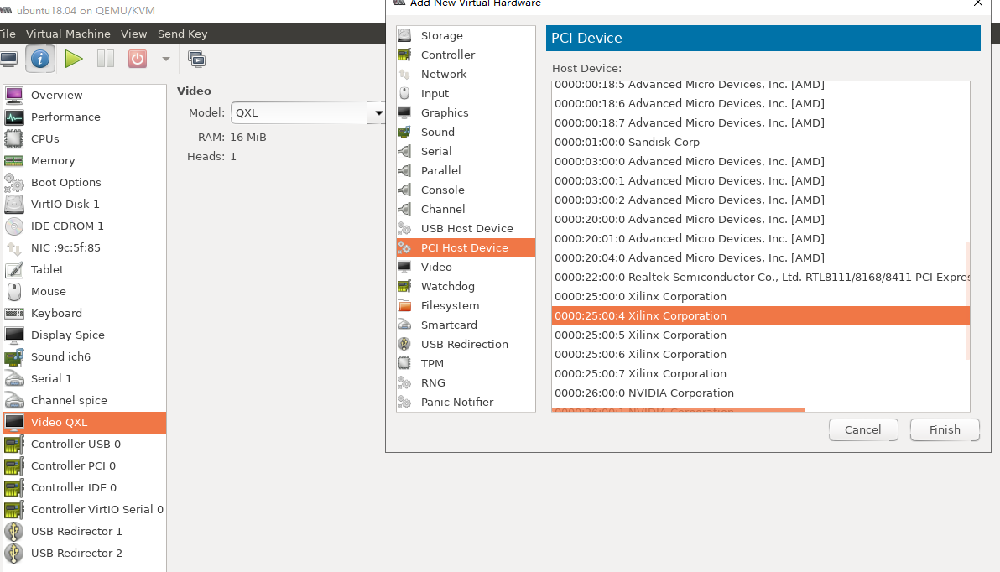
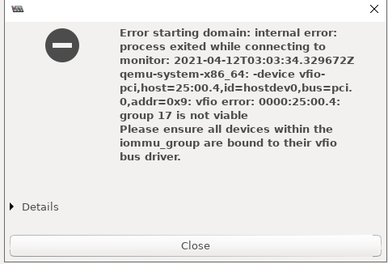
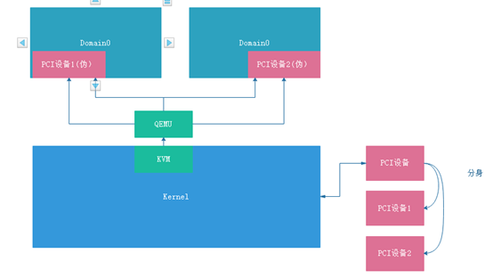

# SR-IOV


## SR-IOV是什么

**SR-IOV的技术的主要作用**： 将一个物理的PCIE设备模拟成多个虚拟设备，其中每一个虚拟设备可以和指定的虚拟机绑定，从而便于多个虚拟机同时访问同一个物理PCIE设备。

支持SR-IOV的设备由多个物理子设备PF，且每一个物理子设备PF支持多个虚拟子设备VF。

每个PF都有自己的唯一的配置空间，且PF关联的VF组共享这个配置空间。但每一个VF都有自己独立的BAR空间。（**问题：VF和PF共享配置空间？？？ 那么VF的Vendor ID和Devcice ID之类的怎么来？ 没描述清楚**。）



## SR-IOV的CAP




```
/* Single Root I/O Virtualization */
struct pci_sriov {
	int		pos;		/* Capability position */
	int		nres;		/* Number of resources */
	u32		cap;		/* SR-IOV Capabilities */
	u16		ctrl;		/* SR-IOV Control */
	u16		total_VFs;	/* Total VFs associated with the PF */
	u16		initial_VFs;	/* Initial VFs associated with the PF */
	u16		num_VFs;	/* Number of VFs available */
	u16		offset;		/* First VF Routing ID offset */
	u16		stride;		/* Following VF stride */
	u16		vf_device;	/* VF device ID */
	u32		pgsz;		/* Page size for BAR alignment */
	u8		link;		/* Function Dependency Link */
	u8		max_VF_buses;	/* Max buses consumed by VFs */
	u16		driver_max_VFs;	/* Max num VFs driver supports */
	struct pci_dev	*dev;		/* Lowest numbered PF */
	struct pci_dev	*self;		/* This PF */
	u32		class;		/* VF device */
	u8		hdr_type;	/* VF header type */
	u16		subsystem_vendor; /* VF subsystem vendor */
	u16		subsystem_device; /* VF subsystem device */
	resource_size_t	barsz[PCI_SRIOV_NUM_BARS];	/* VF BAR size */
	bool		drivers_autoprobe; /* Auto probing of VFs by driver */
};
```


具体配置参考： https://www.yuque.com/docs/share/1db5c054-68a1-4134-b184-e0f02884f820?# 《9.PCIE总线和虚拟化技术》


## 软件初始化流程




## 使用过程

### 配置空间

```bash
(base) baiy@inno-MS-7B89:~$ sudo lspci -s 25:00.0 -xxxxvvvv
[sudo] password for baiy: 
25:00.0 Memory controller: Xilinx Corporation Device 9032 (rev 03)
	Subsystem: Xilinx Corporation Device 9032
	Control: I/O- Mem- BusMaster- SpecCycle- MemWINV- VGASnoop- ParErr- Stepping- SERR- FastB2B- DisINTx-
	Status: Cap+ 66MHz- UDF- FastB2B- ParErr- DEVSEL=fast >TAbort- <TAbort- <MAbort- >SERR- <PERR- INTx-
	Interrupt: pin A routed to IRQ 11
	Region 0: Memory at f0000000 (32-bit, non-prefetchable) [disabled] [size=16M]
	Region 2: Memory at e0000000 (32-bit, non-prefetchable) [disabled] [size=256M]
	Expansion ROM at f1000000 [disabled] [size=512K]
	Capabilities: [40] Power Management version 3
		Flags: PMEClk- DSI- D1- D2- AuxCurrent=0mA PME(D0-,D1-,D2-,D3hot-,D3cold-)
		Status: D0 NoSoftRst+ PME-Enable- DSel=0 DScale=0 PME-
	Capabilities: [60] MSI-X: Enable- Count=2 Masked-
		Vector table: BAR=0 offset=00000040
		PBA: BAR=0 offset=00000050
	Capabilities: [70] Express (v2) Endpoint, MSI 00
		DevCap:	MaxPayload 512 bytes, PhantFunc 0, Latency L0s <64ns, L1 <1us
			ExtTag- AttnBtn- AttnInd- PwrInd- RBE+ FLReset- SlotPowerLimit 26.000W
		DevCtl:	Report errors: Correctable- Non-Fatal- Fatal- Unsupported-
			RlxdOrd+ ExtTag- PhantFunc- AuxPwr- NoSnoop+
			MaxPayload 128 bytes, MaxReadReq 512 bytes
		DevSta:	CorrErr+ UncorrErr- FatalErr- UnsuppReq+ AuxPwr- TransPend-
		LnkCap:	Port #0, Speed 8GT/s, Width x2, ASPM not supported, Exit Latency L0s unlimited, L1 unlimited
			ClockPM- Surprise- LLActRep- BwNot- ASPMOptComp+
		LnkCtl:	ASPM Disabled; RCB 64 bytes Disabled- CommClk+
			ExtSynch- ClockPM- AutWidDis- BWInt- AutBWInt-
		LnkSta:	Speed 5GT/s, Width x2, TrErr- Train- SlotClk+ DLActive- BWMgmt- ABWMgmt-
		DevCap2: Completion Timeout: Range BC, TimeoutDis+, LTR-, OBFF Not Supported
		DevCtl2: Completion Timeout: 50us to 50ms, TimeoutDis-, LTR-, OBFF Disabled
		LnkCtl2: Target Link Speed: 8GT/s, EnterCompliance- SpeedDis-
			 Transmit Margin: Normal Operating Range, EnterModifiedCompliance- ComplianceSOS-
			 Compliance De-emphasis: -6dB
		LnkSta2: Current De-emphasis Level: -6dB, EqualizationComplete-, EqualizationPhase1-
			 EqualizationPhase2-, EqualizationPhase3-, LinkEqualizationRequest-
	Capabilities: [100 v1] Advanced Error Reporting
		UESta:	DLP- SDES- TLP- FCP- CmpltTO- CmpltAbrt- UnxCmplt- RxOF- MalfTLP- ECRC- UnsupReq- ACSViol-
		UEMsk:	DLP- SDES- TLP- FCP- CmpltTO- CmpltAbrt- UnxCmplt- RxOF- MalfTLP- ECRC- UnsupReq- ACSViol-
		UESvrt:	DLP+ SDES+ TLP- FCP+ CmpltTO- CmpltAbrt- UnxCmplt- RxOF+ MalfTLP+ ECRC- UnsupReq- ACSViol-
		CESta:	RxErr- BadTLP- BadDLLP- Rollover- Timeout- NonFatalErr-
		CEMsk:	RxErr- BadTLP- BadDLLP- Rollover- Timeout- NonFatalErr+
		AERCap:	First Error Pointer: 00, GenCap- CGenEn- ChkCap- ChkEn-

	Capabilities: [140 v1] Single Root I/O Virtualization (SR-IOV)
		IOVCap:	Migration-, Interrupt Message Number: 000
		IOVCtl:	Enable- Migration- Interrupt- MSE- ARIHierarchy-
		IOVSta:	Migration-
		Initial VFs: 4, Total VFs: 4, Number of VFs: 0, Function Dependency Link: 00
		VF offset: 4, stride: 1, Device ID: 0000
		Supported Page Size: 00000553, System Page Size: 00000001
		Region 0: Memory at f1080000 (32-bit, non-prefetchable)
		VF Migration: offset: 00000000, BIR: 0
	Capabilities: [180 v1] Alternative Routing-ID Interpretation (ARI)
		ARICap:	MFVC- ACS-, Next Function: 0
		ARICtl:	MFVC- ACS-, Function Group: 0
	Capabilities: [1c0 v1] #19
00: ee 10 32 90 00 00 10 00 03 00 80 05 10 00 00 00
10: 00 00 00 f0 00 00 00 00 00 00 00 e0 00 00 00 00
20: 00 00 00 00 00 00 00 00 00 00 00 00 ee 10 32 90
30: 00 00 00 f1 40 00 00 00 00 00 00 00 0b 01 00 00
40: 01 60 03 00 08 00 00 00 05 60 80 01 00 00 00 00
50: 00 00 00 00 00 00 00 00 00 00 00 00 00 00 00 00
60: 11 70 01 00 40 00 00 00 50 00 00 00 00 00 00 00
70: 10 00 02 00 02 80 68 00 10 28 09 00 23 f0 43 00
80: 40 00 22 10 00 00 00 00 00 00 00 00 00 00 00 00
90: 00 00 00 00 16 00 00 00 00 00 00 00 0e 00 00 00
a0: 03 00 00 00 00 00 00 00 00 00 00 00 00 00 00 00
b0: 00 00 00 00 00 00 00 00 00 00 00 00 00 00 00 00
c0: 00 00 00 00 00 00 00 00 00 00 00 00 00 00 00 00
d0: 00 00 00 00 00 00 00 00 00 00 00 00 00 00 00 00
e0: 00 00 00 00 00 00 00 00 00 00 00 00 00 00 00 00
f0: 00 00 00 00 00 00 00 00 00 00 00 00 00 00 00 00
100: 01 00 01 14 00 00 00 00 00 00 40 00 30 20 46 00
110: 00 00 00 00 00 e0 00 00 00 00 00 00 00 00 00 00
120: 00 00 00 00 00 00 00 00 00 00 00 00 00 00 00 00
130: 00 00 00 00 00 00 00 00 00 00 00 00 00 00 00 00

140: 10 00 01 18 00 00 00 00 00 00 00 00 04 00 04 00
150: 00 00 00 00 04 00 01 00 00 00 00 00 53 05 00 00
160: 01 00 00 00 00 00 08 f1 00 00 00 00 00 00 00 00
170: 00 00 00 00 00 00 00 00 00 00 00 00 00 00 00 00
180: 0e 00 01 1c 00 00 00 00 00 00 00 00 00 00 00 00
190: 00 00 00 00 00 00 00 00 00 00 00 00 00 00 00 00
1a0: 00 00 00 00 00 00 00 00 00 00 00 00 00 00 00 00
1b0: 00 00 00 00 00 00 00 00 00 00 00 00 00 00 00 00
1c0: 19 00 01 00 00 00 00 00 00 00 00 00 00 00 00 00
1d0: 00 00 00 00 00 00 00 00 00 00 00 00 00 00 00 00
......
```


### 使能SR-IOV

#### 使能前

```
(base) baiy@inno-MS-7B89:~$ lspci | grep -i xi
25:00.0 Memory controller: Xilinx Corporation Device 9032 (rev 03)

```


#### 使能后

```
25:00.0 Memory controller: Xilinx Corporation Device 9032 (rev 03)
25:00.4 Memory controller: Xilinx Corporation Device 0000 (rev 03)  // VF0
25:00.5 Memory controller: Xilinx Corporation Device 0000 (rev 03)	// VF1
25:00.6 Memory controller: Xilinx Corporation Device 0000 (rev 03)	// VF2
25:00.7 Memory controller: Xilinx Corporation Device 0000 (rev 03)	// VF3
```


#### 将VFn导入到虚拟机中




注：如果上层链路ACS未支持，那么就无法导入到虚拟机中，出现




#### 导入虚拟机启动

在虚拟机中可见到当前VF的设备（虚拟机中使用的设备，其实是QEMU模拟的设备，但PCI读写等操作接口都是使用物理机器的PCI读写接口）




### SR-IOV的使用限制

1. CPU及主板硬件 必须支持IOMMU/VT-D/SMMU（不同架构称呼不同）的其中一种，且支持SR-IOV功能。
2. Upstream必须支持ACS，否则路由划分的时候，会将PCIE PF和VF设备划分到同一个group中，导致无法单独添加到某一个设备里边去。
3. 本身设备可选支持ATC和ACS。
4. PF可以实现INTx，但PF和VF必须支持MSI或者MSI-X 其中之一 ，或者都支持。
5. SR-IOV在启动过程会执行FLR，设备必须支持FLR且必须按照规范在100ms内完成FLR复位，负责启动失败。


