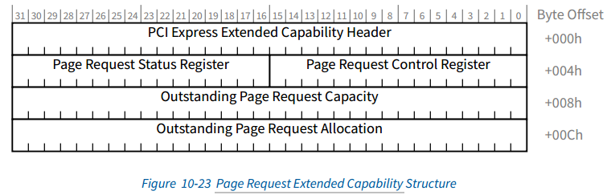

[TOC]


## 相关参考和目标

### 参考资料

* <font color=#008000>《PCI+EXPRESS体系结构导读.pdf》13.2节</font>
* <font color=#008000>《PCI Express Base_r5_1.pdf》第10章</font>
* [《PCIe_IOV_WP_CHS》](https://www.docin.com/p-134308563.html)

### 目标

* 了解ATS的作用
* 学习ATS在协议中的描述
* 学习ATS在Linux代码中的实现部分


## ATS Architectural Overview

### IOMMU带来的好处和缺陷

前边说了 现代体系结构中,IOMMU为虚拟化以及DMA传输带来了很大的方便。但IOMMU又带来了什么缺陷？


#### IOMMU的好处

* IOMMU限制“中断”或 非法的的DMA I/O功能的破坏性- DMA传输越界到不同的domain上去（比如通过DMA直接给MSI Vector地址写数据是不行的）。
* 提供DMA的分散/聚集传输（IO页表的存在，使得DMA支持不连续的物理内存传输）。
* 能够将MSI/MSI-X中断重定向到不同的Domain，中断的虚拟化支持。
* 地址空间转换（将32位I/O功能转换为更大的系统地址空间），使得不同总线位宽的外设可以 和 所有主存进行交互。
* 虚拟化Virtualization支持。
* 将页表与进程关联，使得支持在用户空间使用IOMMU。


#### IOMMU引发的问题

不管是为了什么功能，主机系统中DMA地址转换的存在对DMA访问<font color=red>有一定的性能影响（ 由于解析实际物理地址所需的时间，DMA访问时间显著延长）</font>。

如果实现机制是  需要访问驻留在主存储器中的页表，则访问时间可能比未翻译的访问时间长得多。 另外，如果每个事务需要多个内存访问（例如，对于表遍历），那么与DMA相关联的内存事务速率（即开销）可以很高。


### ATC的作用

前边说过，<font color=red>IOMMU</font>对于每个TLP包发来的地址，都会从TA将总线地址转为对应的物理地址（HPA），<font color=red>造成了很大的性能影响</font>。

为了<font color=red>减轻IOMMU这个查找页表造成的性能影响，引入了ATC（类似于CPU的TLB），这里叫做Address Translation cache 或者ATC</font>。


ATC就像是页表的一片缓存（快速页表），当用户频繁操作某一片连续的内存时，使用的虚拟地址可通过Cache快速查找到物理地址。

> TLB是MMU的一个缓存表，CPU发出VA时需要通过MMU转换为PA， 这时需要查询页表。为了提高性能，MMU内部集成了一个Cache，可以按页缓存页表项， CPU发的的VA在命中TLB时，可以快速定位到真实的物理地址。
>
> 


<font color=red>举例说明TLB和TA的作用</font>：

TLB和ATC  就像微信聊天的 “主页”- 最近联系人界面， 这个相当于快速通道。    能在最近联系人界面找到需要聊天的:girl:，这就是Cache命中。

如果与某个:girl:没聊过天，则需要从联系人列表去找，这就是TTW和TA， 比较麻烦。  这就是Cache未命中。

从联系人找到后，聊了一句话之后，就可以在最近联系人界面找到了，下次在聊就可以直接走“快速通道”。 这个过程，叫做刷新Cache。


> :notes:学习缓存可以参考 ： [高速缓存与一致性专栏索引](https://zhuanlan.zhihu.com/p/136300660)  


> 什么叫Cache 抖动**抖动(thrash)** 
>
> 因为手机内存有限（Cache空间很小)，为了方便使用，把不经常使用的联系人从最近列表中删除了，是常用操作。 :poop:
>
> 但这两天和:girl:聊天， 过两天 和 :woman: 聊天，然后在过两天和:girl:聊天...... 不停的删除，更新，删除，更新... 
>
> 影响了 个人发挥（性能）， 这就叫Cache抖动。


<font color=red>PCIE设备集成ATC的优点</font>

* 通过ATC来减轻ATPT的压力（减少TA内“thrash（刷Cache）”的次数）； //  因为一个通路地址连续的可能性较大。 多个PCIE 通路汇聚在中心TA，就相当于多任务切换，HPA跨度可能很大，导致ATPT不停的刷Cache。 但如果集成ATC，那么在设备端就进行地址转换了。TA看到有TLP包中TA标记，则直接bypass。
* 使ATC设备对  “System ATC size” 的性能依赖性更小。  // 同上，将cache分摊到各个设备上去。
* 设备能够根据功能类型优化ATC性能。
* 通过向 central complex 发送预 地址转换请求，确保最佳访问延迟的可能性。 // 简单说，自己存一个页表，来提高数据传输性能
* <font color=blue>使用ATC可以进行内存保护，避免恶意的PCIE设备发送的地址不属于当前Domain，从而影响了别的虚拟机。</font>


> Spec 提供 允许PCIe设备与TA一起使用的互操作性，但TA及其 Address Translation and Protection T able (ATPT)被视为特定于实现的，不在Spec的范围内。


### ATS Overview

前边一直说ATC，但本文内容是ATS， 那么什么是ATS？ 


#### ATS的作用

ATS（Address Translation Services）就是一组<font color=red>request-completion protocol服务，用来刷新和下发ATC页表的（类似TLB的刷新过程）</font>。


ATS（Address Translation Services）定义了一组新的TLP， 使用 EP和RC request-completion protocol   来提供 address translation  Services。

另外，<font color=red>在MemRd和MemWr报文中 TLP中定义了一个新的AT字段。新的 AT字段使RC能够确定当前的TLP请示 是否已经通过ATS协议被翻译</font>（参考后边：Memory Requests with Address Type）


##### Single-func EP的ATS过程

ATS转换请求操作的基本流程


在此示例中， **single-Function PCIe Device 发送和接收 ATS Request 和 ATS Completion请求**。 


**在ATC中进行地址转换可以带来性能上提升成都，需要考虑很多因素，主要是看依赖Cache命中率是否高**：

* 在较长时间内频繁访问内存地址范围， 或相关缓冲区的刷新率很高。
* 内存地址范围，如工作和完成队列结构，用于低延迟的数据缓冲区通信、图形帧缓冲区、用于缓存函数特定内容的主机内存等。

总结：其实就是Cache命中率高不高的问题，在Cache命中率很高的情况下会带来性能显著提升。 在Cache命中率不高的情况下，会频繁刷新Cache，造成Cache抖动很大，那么对性能造成了很大的影响。


*PCI设备生成一个ATS转换请求，该请求通过PCIe层次结构上游发送给RC，然后由RC转发给TA。*

*ATS转换请求使用与Spec中定义的相同的路由和排序规则。 此外，在任何给定时间都可能有多个ATS转换请求未完成； 也就是说，ATS请求可能在一个或多个TC上流水线处理多个请求。 每个TC代表一个唯一的排序域，并定义关联的ATS转换完成必须使用的域。*


##### multi-function的ATS

ATS在multi-function设备的实现有以下特点： // 总结：<font color=red>每个Function 都有ATC,但不需要在每个Function上实现ATS</font>

* 每个ATC都与一个Function关联。 每个支持ATS的Function都必须能够发出和接收每种ATS转换请求或转换完成类型中的至少一种。
* 每个ATC在 每个Function的基础上进行配置和访问。 不需要 multi-function PCIE Device 在每个Function上实现ATS。
* 如果ATC实现在一组Function之间共享资源，则要求逻辑行为与完全独立的ATC实现一致。


**具备条件**

与设备内的Function 数量无关，以下各项基础条件是必需的：  // 总结： <font color=red>软件禁止修改ATC，每个Function的ATC 只能使用ATS协议填充ATC</font>

* 只能通过ATS转换请求和转换完成协议获得了TLP中的地址， 否则该Function不得发布任何带有AT字段的TLP。

* 要求仅使用ATS协议填充每个ATC；即： 响应于Function 针对给定地址发出ATS转换请求的功能，必须通过ATS转换完成Function来填充ATC中的每个条目。

* 除非通过ATS协议，否则无法修改每个ATC：

  a. 主机系统软件只能通过本规范中定义的协议来修改ATC，只能使ATC中的一个或多个转换无效。 设备或功能重置将是由软件执行的用于更改ATC内容的操作的示例，但是重置仅允许使条目无效，而不能修改其内容。

  b. 主机系统软件不能使用在设备上执行的软件来修改ATC。

* 当TA确定某个功能不再应在其ATC内维护转换时，TA会启动ATS无效协议。 失效协议由一个失效请求和一个或多个失效完成组成。


##### ATS的转换过程

###### ATS Translation Request

TA收到 ATS Translation Request 执行下列过程：

1. 验证 Function设备 已配置为发出ATS转换请求。

2. 确定 Function设备 是否可以访问由 ATS转换请求 指示的<font color=red>内存并具有关联的访问权限</font>。

3. 确定是否可以向 该Function设备 提供 translation 。如果可以，则TA向 该Function设备 发布translation。

   a.  ATS需要支持各种页面大小，以适应各种ATPT和处理器实现。

   ​     1) 页面大小必须为2^n 并对齐。

   ​     2) 支持的最小页面大小为4096字节。需要支持ATS的组件才能支持此最小页面大小。

   b. 为了给Function设备提供最优的资源使用， ATS 必须向 Function 设备 告知需要支持的最小转换大小或无效大小。最小的转换大小必须为4096字节。

4. TA将请求的成功或失败传达给RC，RC生成ATS转换完成，并通过响应TLP通过RP发送给Function 设备。

   a. 要求RC为每个ATS转换请求 生成至少一个ATS转换完成；注：与请求的成功或失败无关，最少存在1:1对应关系。

   ​	1）成功的Translation   会为  每个请求产生  一个或者两个ATS翻译完成TLP。翻译完成指示所涵盖的翻译范围。

   ​	2）RC可以流水线化多个ATS转换完成；即，RC可以返回多个ATS转换完成，并且这些ATS转换完成可以相对于ATS转换请求采用任何顺序。

   ​	3）要求RC使用与相应的ATS转换请求相同的TC（流量类别）来发送ATS转换完成。

    b. 请求的地址可能无效。要求RC发出转换完成，指示无法访问所请求的地址。


###### ATS Translation completion

当 Function设备 收到ATS转换完成信息并更新其ATC  ，或者标记该translation无效。Function设备继续处理其工作请求，并根据完成的结果使用转换后的地址或未转换的地址生成后续请求。

* 与读取完成类似，需要function设备  为每个completion 分配资源空间，而又不引起PCIe链路上的backpressure。 // 其实就是 刷新Cache
*  丢弃“过时”的Cache。


###### ATS需要兼容以下功能

可以推测，ATS转换请求和转换完成处理 在概念上是相似的，并且在许多方面和  PCIe读取请求和读取完成处理相同。这是为了降低设计复杂性并简化ATS与现有和新的基于PCIe的解决方案的集成。请记住，ATS需要满足以下条件：

* 支持ATS的组件必须与[PCIe-1.1]兼容组件互操作。

* 通过新的CAP和关联的配置结构启用了ATS。 要启用ATS，软件必须检测到此CAP并启用功能以发布ATS TLP。

  如果未启用功能，则要求该Function设备不发出ATS转换请求，并且必须发出所有TLP AT字段设置为“未转换”的DMA读取和写入请求。 // <font color=red> 也就是 未启用ATS CAP的时候，TLP包的TA字段必须设置为 “未转换”。</font>

* 使用基于地址的路由或Request ID（RID）路由来 路由ATS TLP。

* ATS TLP必须使用与本规范中指定的排序规则相同的排序规则。

* 要求ATS TLP未经修改地流过[PCIe-1.1]兼容交换机。

* 允许Function 设备 混合使用已翻译和未翻译的请求。

* 要求ATS事务不依赖内存请求的地址字段 来传递PCI-SIG定义的当前用途以外的其他信息。


##### ATS Invalidation（有部分未理解）

如下图所示，ATS Invalidation协议实质上包含三个步骤：

1. **系统软件 更新TA使用的表中的条目。更新表后，TA确定应在ATC中使转换无效，并启动一个无效请求TLP，该请求将从RP发送到示例中的single-function 设备。无效请求传送未翻译的地址范围，TC和RP唯一标记，该标记用于将无效完成与无效请求相关联**。

2. **Function接收无效请求，并使所有匹配的ATC条目无效。**收到无效请求后，不需要function立即刷新所有未决请求。如果事务在队列中等待发送，则即使这些事务使用无效的地址，函数也不必删除队列中的请求。

   a.  要求某个Function不表明无效已经完成，直到所有未完成的引用关联翻译地址的读取请求或翻译请求都已被淘汰或无效。

   b. 要求有一个Function来确保到RC的无效完成指示将在任何先前发布的使用“陈旧”地址的写入之后到达RC。

3. **当某个Function确定已转换地址的所有使用均已完成时，它将发出一个或多个ATS无效补全**。

   a. 为可能引用了无效范围的每个TC发出无效完成。 这些完成充当冲洗机制，以确保清除层次结构中所有可能包含对已转换地址的引用的正在进行中的事务。

   ​	1) 所需的完成次数在每个“无效完成”中传达。 TA或RC实现可以维护一个计数器，以确保在考虑不再使用转换之前已收到所有无效完成。

   ​	2) 如果发送了多个Invalidation Complete，则每个TC中发送的 Invalidate Completion 必须在10.3.2节中详述的字段中相同。

    b. 无效完成包含来自无效请求的ITAG，以使RC能够关联无效请求和完成。

   


> #### 实施说明
>
>
> 地址范围重叠未翻译和已翻译的地址范围很可能会重叠，可能是整个重叠。 这不是ATS的要求，但可能是对TA的实现限制，以便可以正确路由内存请求。
>


### :disappointed_relieved:PRI的扩展（纯翻译，没看懂，TBD）

**PRI：PCIE引入的Page Request Interface，是ATS的一个扩展项，<font color=red>允许Endpoint请求OS提供映射了页面的内存给DMA使用</font>。**


ATS 提高了 基于DMA 的数据搬移的行为。

关联的  **Page Request Interface（PRI）**   通过  允许启动DMA操作 而无需固定所有要 移入或移出 系统内存的数据而提供了其他优势（锁住，因此系统动态分页机制无法将其替换掉）。 

与固定内存相关联的开销可能不大，但是从可分页缓冲池中删除大部分内存对系统性能的负面影响可能很大。 // ？？？

***PRI在功能上独立于ATS的其他方面。也就是说，支持ATS的设备不需要支持PRI，但是PRI依赖于ATS的功能**。*


// 后边暂时没看懂

> *可以构造  智能I/O设备    以充分利用动态内存接口。从设备的角度来看，固定将始终具有最佳的性能特征-保证要触摸的所有内存都存在。但是，确保设备可能接触的所有存储器的驻留可能会出现问题，并在主机上强制导致设备感知程度欠佳。允许设备更独立地运行（当它需要不存在的内存资源时出现页面错误）可提供设备与主机之间的更高级别的耦合。*
>
> 
>
> *用于利用页面请求接口的机制是特定于设备的。作为其中一个这样的接口可以改善整体系统性能的模型的示例，让我们研究一下高速LAN设备。这样的设备知道其突发速率，并且仅需要在某个量子范围内可以接收的物理缓冲区空间就可以用于入站数据。可以使未固定虚拟内存页的向量可用于设备，然后设备根据需要请求以维持其突发窗口。这样可以最大程度地减少所需的设备内存占用，并简化与主机的接口，而这两者都不会对性能产生负面影响。*
>
> 
>
> *进行分页的能力引发了页表状态标志管理的问题。典型的TA将标志（例如，脏和访问指示）与每个未翻译的地址相关联。如果没有关于如何管理映射到Function的页面的任何其他提示，则此类TA将需要保守地假定，当它们授予Function读取或写入页面的权限时，该Function将使用该权限。此类可写页面在将其翻译后的地址提供给功能之前，需要先标记为脏页。*
>
> 
>
> *对于不支持分页的函数来说，这种保守的写权限授予脏污行为通常不是一个重要的问题，因为分页是固定在页面上的，因此很少需要支付将干净页面保存到内存中的成本。但是，如果所有可写页面都被视为脏页，则支持页面请求接口的功能可能会遭受重大损失，因为此类功能在运行时不会固定其可访问的内存占用，并且可能会发出推测性的页面请求以提高性能。在这样的系统中保存干净页面（而不只是丢弃它们）的成本可能会降低原本有吸引力的分页技术的价值。在无法写入后备存储的情况下（例如CD-ROM），这可能会导致严重的性能问题并冒着功能问题的风险。*
>
> 
>
> *Translation Requests中的No Write（NW）标志表示函数愿意将其用法限制为仅读取页面，而与原本会被授予的访问权限无关。*
>
> 
>
> *如果设备选择通过发出设置了NW标志的转换请求来选择仅请求读取访问，然后又确定需要将其写入页面，则该设备必须发出新的转换请求。*
>
> *在收到带有NW标记为Clear的翻译请求后，允许TA将相关页面标记为脏。 强烈建议函数除非已获得明确的写许可，否则不要发出此类请求。 写入权限的一个示例是主机向Function发出命令以从存储设备加载数据并将该数据写入内存*


### PASID

Process Address Space ID (PASID）

某些<font color=blue> TLP 可以选择与进程地址空间ID（PASID）相关联。该值使用PASID TLP前缀传递</font>。PASID TLP前缀在第6.20节中定义。

每个Function 都有一组独立的PASID值。PASID字段宽度为20位*(但有效宽度为 受 Root Complex (TA)   支持的宽度和 ATC   支持的宽度中较小者的约束。*

*PASID值的未使用高位必须为0b)*。

> 我们知道，IOMMU可以开启2级地址翻译，将DMA映射到用户进程空间， 其中PASID就是用来管理进程ID和进程对应的虚拟页表的。


PASID TLP前缀允许在：

* 具有未转换地址的内存请求（包括Untranslated AtomicOp Requests）

* Address Translation Requests

* Page Request Messages

* ATS Invalidation Requests

* PRG Response Messages


具有  PASID的地址通常用于表示（GVA）与PASID关联的地址表示来宾物理地址（GPA）。

EPT执行GPA->HPA，而各个Guest OS管理用于执行从GVA到GPA的转换的表

当用相关联的PASID翻译地址时，TA执行两种翻译并返回翻译后的地址（即GVA到GPA，然后GPA到HPA）。中间GPA值对ATC不可见


留个疑问： <font color=red>这里ATC到底起了什么作用？？？？</font>


:link: ！！！以下内容非开发人员不需要看


## ATS TLP包

TA负责地址转换。 ATC可以缓存这些转换页表。 如果ATC通过PCIe与TA分离，则来自ATC的内存请求将需要能够指示事务中的地址是否已转换。 

在本节中将描述  对内存事务的修改，以及用于在远程ATC和中央TA之间传递转换的事务。


### 内存读写的AT标记

前边说过，支持ATS功能的设备，<font color=red>在内存读写 TLP中定义了一个新的AT字段。新的 AT字段使RC能够确定给定的请求是否已经通过ATS协议被翻译</font>


* 2'b00: TLP中Address 字段没有经过ATC转换，存访的是PCIE总线地址。（默认）

* 2'b01: TLP中Translation Request（刷新Cache请求）报文。

  <font color=blue>TA收到该字段后，根据I/O页表，将合适的地址转换关系，通过存储器读写TLP，从RC发送给TLP设备，TLP设备更新ATC</font>。

* 2‘b10: Translated（转换）报文标记：当前TLP包的地址 已经转换，不需要TA再次转换（TA Bypass这类报文）

  注：这类报文转换过后，Address仍然是总线地址，不过从GPA的总线地址，已经转为了HPA的总线地址。

  

#### 转换请求TLP

Translation Request格式和memRd TLP包相似。AT字段用来区分 Translation Request 还是 普通报文。（01是Translation Request报文）


##### Untranslated Address 

转换请求包括32位或64位未转换地址字段。该字段指示要转换的地址。 TA将根据 转换请求中的地址来决定请求的有效性。 

允许TA返回的转换长度 小于申请的地址范围（TA不能给出多余申请的范围）。


##### Length

<font color=blue>未转换的地址长度 由Length决定，因为这里传输的是GPA（地址连续），但HPA不一定连续，所以TA可能会发送多组转换关系。</font>


##### NW Flag（不建议配置，忽略）

当NW(no write）Flag设置后，表示该功能正在请求对该转换的只读访问。

在收到带有NW标志Clear的 转换请求后，允许将关联页面标记为脏。 强烈建议函数除非已获得明确的写许可，否则不要发出此类请求。


##### PASID Prefix

如果 Translation Request  前边带了PASID Prefix， Untranslated Address字段是由PASID字段指示的进程地址空间内的地址（GVA）。

如果 转换请求具有带有特权模式请求位或执行请求位设置的PASID TLP前缀，则可以在构造转换完成数据条目时使用这些前缀。

PASID Cap表明  是否支持并启用了发送和接收带有PASID TLP前缀的TLP的功能。


#### 转换完成TLP

当TA收到Translation Request格式报文后，会去查找ATPT来获取地址转换关系。如果转换成功， TA使用CpID（带数据的存储器读完成报文）将转换关系发送给PCIe设备，否则使用CpL报文发送给PCIe设备。


##### Translated Address

代表发出的转换完成的地址。也就是HPA。

S:   和 Translated Address联合使用，代表地址范围（大小）。 

N:  硬件是否需要Cache一致性操作。

U:  HPA只能用Untranslated Address 进行访问，不能用AT字段为（2‘b10 转换完成报文）来访问。

W: HPA地址可写  

R:  HPA地址可读


#### ATS是如何保护内存访问的（重点）

PCIe设备发出的地址在未命中ATC时，怎么办？ 

1. 刷新ATC，更新页表。
2. 直接绕过ATC，使用TA进行转换。

但方法2 存在缺陷，假如PCIe设备发出的地址不属于当前Domain，那么访问后会破坏其他虚拟机，甚至破坏了主机系统。


### Invaild ATC

说白了，就是系统更新了页表后（比如QEMU创建虚拟机后，会更新页表），需要刷新ATPT，但如何同步到ATC？

TA会使用MsgD报文来通知给相应的PCIe设备，并Invaildate ATC中相应的Entry。

如下图所示，TA每次只能发出一条Invaildate Entry。


### ATS 配置空间

#### ATS Extended Capability

ATS配置空间位于PCIE Extended配置空间


#### Page Request Extended Capability Structure




## :smile:ATS的软件操作 

### ATS初始化

初始化代码中 <font color=red>只获取了ATS CAP的位置</font> 

```
linux-4.14.89\drivers\pci\ats.c

pci_init_capabilities
	pci_ats_init(dev);
		pos = pci_find_ext_capability(dev, PCI_EXT_CAP_ID_ATS);
		struct pci_dev *ats_cap = pos; 
```


### 支持接口

#### enable 和 disable

```
pci_enable_ats
	ctrl = PCI_ATS_CTRL_ENABLE;
	dev->ats_stu = ps;	// ps为页大小 #define VTD_PAGE_SHIFT		(12)
	ctrl |= PCI_ATS_CTRL_STU(dev->ats_stu - PCI_ATS_MIN_STU);  // 计算STU
	pci_write_config_word(dev, dev->ats_cap + PCI_ATS_CTRL, ctrl);
	

pci_disable_ats
	ctrl &= ~PCI_ATS_CTRL_ENABLE;
	pci_write_config_word(dev, dev->ats_cap + PCI_ATS_CTRL, ctrl);
```


#### pri配置（TBD）


#### pasid配置


