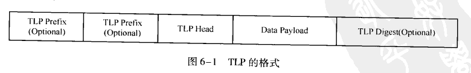
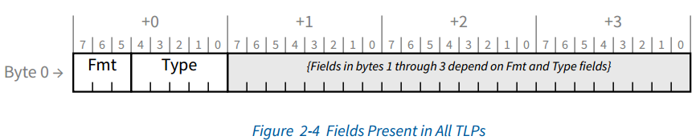
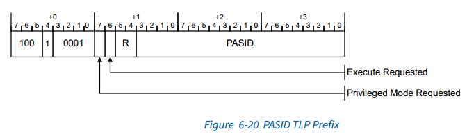
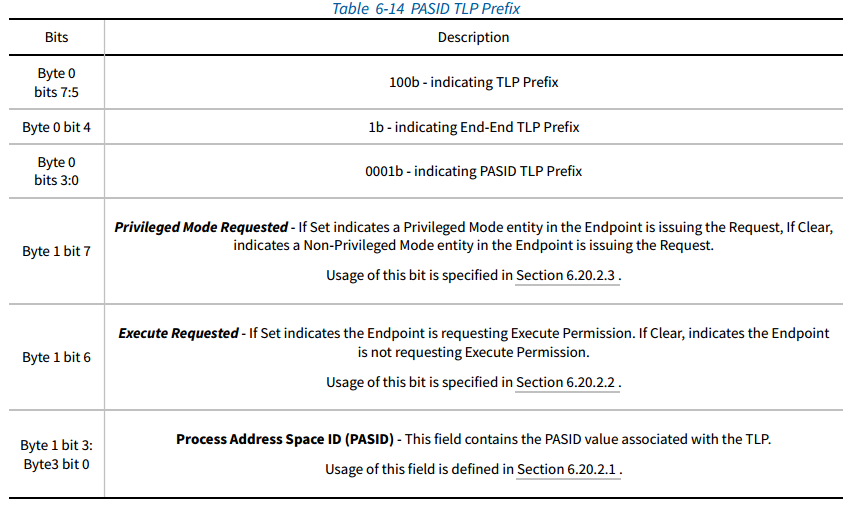
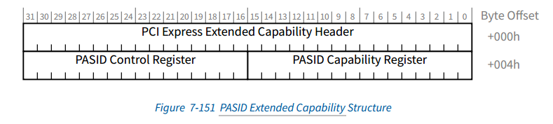
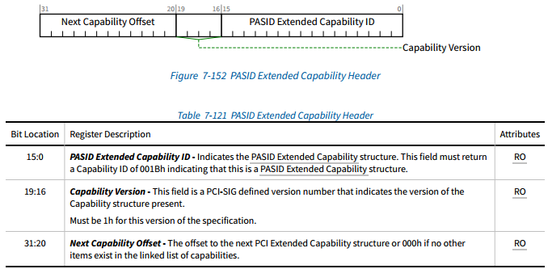
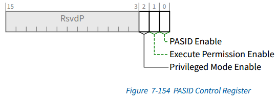
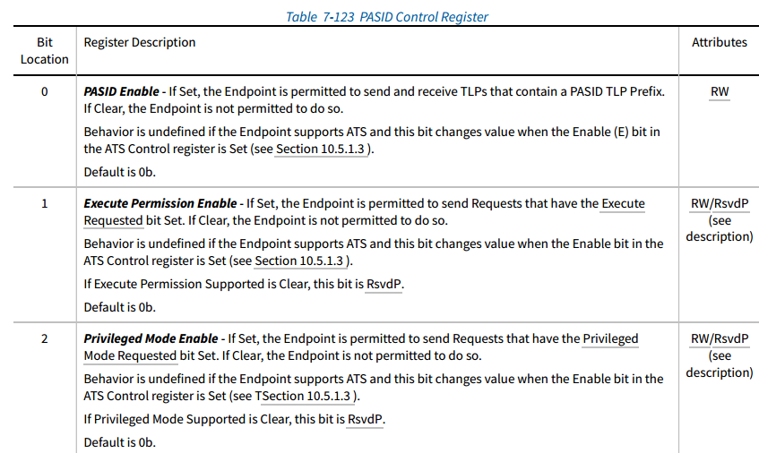

# PASID TLP Prefix

## 参考和疑问

### 相关参考

* 《PCI Express Base_r5_1.pdf》 6.20
* 《PCI Express Base_r5_1.pdf》 7.8.8

### PASID的作用

PASID TLP前缀是  第2.2.1节中定义的端到端TLP前缀。 PASID TLP前缀的布局如图6-20和表6-14所示。

当存在PASID TLP前缀时，前缀中的  PASID值与 Request_ID   一起标识  与请求关联的过程地址空间ID。 

每个Function 都有一组不同的PASID值。 一个Function使用的PASID值与任何其他 Function 使用的PASID值无关。

在以下情况下允许使用PASID TLP前缀：

* Memory Requests  with Untranslated Addresses （请参阅第2.2.4.1节）。
*  Address Translation Requests， ATS Invalidation Messages， Page Request Messages 和PRG响应消息（请参见10.1.3节）。
* 在任何其他TLP上都不允许使用PASID TLP前缀。

### Managing PASID TLP Prefix Usage

对于EP功能（包括RC内嵌EP设备），适用以下规则：

* 除非设置了PASID启用，否则不允许功能发送和接收带有PASID TLP前缀的TLP
* Function 必须具有将PASID的使用与特定Functioncontext 动态关联的机制。 此机制是 特定于设备的。
* Function 必须具有一种机制来请求其正常停止使用特定的PASID。 

对于RC功能，有以下规则：

* 必须具有 device specific  的机制 来支持 PASID TLP前缀。
* 支持PASID TLP前缀的 RC必须具有  启用它们的特定设备的机制。 默认情况下，禁用PASID TLP前缀的使用。
* 支持PASID TLP前缀的RC 可以选择具有  特定设备的机制，以使其比整个RC的粒度更精细。

### PASID TLP Layout

先看下TLP格式，以及TLP Prefix结构：

#### PASID field

PASID 字段标识与请求关联的用户进程。 所有PASID TLP前缀中都存在此字段。

PASID字段为20位宽。 EP和RC不必支持整个字段范围。 对于EP，“最大PASID宽度”字段指示支持的PASID值范围。

#### Execute Requested

如果 Execute Requested  的位置1，则端点正在请求与该请求关联的内存范围内的端点执行指令的权限。 执行许可的含义超出了本规范的范围。

除非支持执行许可，否则不允许EP发送 设置Execute Requested  （第7.8.8.2节）和 Execute Permission Enable（第7.8.8.3节）的TLP。

#### Privileged Mode Requested

如果设置了 “请求的特权模式”，则端点发出针对与“特权模式”关联的内存的请求。 如果“请求的特权模式”为“清除”，则端点将发出一个针对与“非特权模式”关联的内存的请求。

特权模式和非特权模式的含义以及端点以特权或非特权模式运行的含义取决于系统的保护模型，并且不在本规范范围之内。

除非端点都具有特权模式，否则不允许端点发送设置了特权模式请求位的TLP 设置支持的位（第7.8.8.2节）和特权模式使能位（第7.8.8.3节）。

## PASID配置空间

### HEADER

### PASID Capability Register (Offset 04h)

### PASID Control Register (Offset 06h)

## PASID软件功能